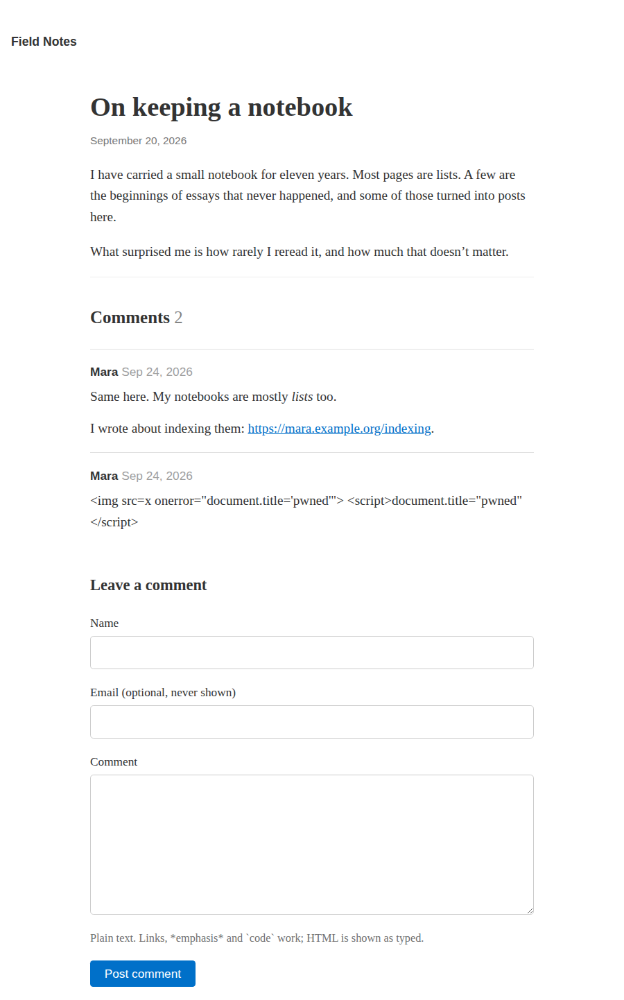
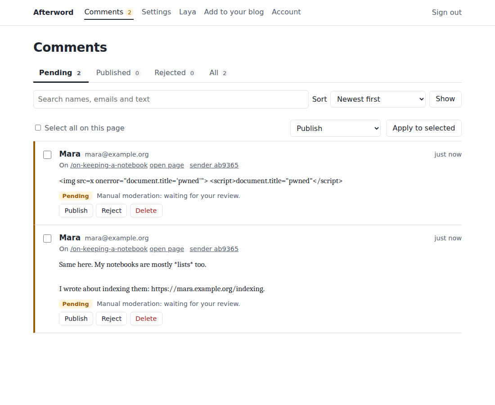

# Afterword

A small, self-hosted comment server for personal blogs, made with self-hosted
[WriteFreely](https://writefreely.org) in mind.

Readers leave a comment with a name and a message, and optionally an email
address that is never shown. No accounts, no likes, no tracking. Comments
appear on your blog as ordinary HTML elements that your existing stylesheet
already styles, and you moderate them from a compact dashboard.

Optionally, a local [Laya](docs/laya.md) model can score spam. It is never
required, installs with one button, and never gets the final word unless you
say so.

| On your blog | In your dashboard |
|---|---|
|  |  |

- **One process, one file.** Python standard library plus `waitress`; everything is in one SQLite file.
- **Safe by construction.** Comments are plain text. The server never produces HTML for them, and the widget never parses HTML. See the [threat model](docs/threat-model.md).
- **Your CSS.** No iframe, no shadow DOM, documented `afterword-…` classes. See [styling](docs/styling.md).
- **Three moderation modes.** Manual, assisted or automatic, switchable any time.

## Quick start (try it locally)

```sh
cd afterword                              # the folder containing this README
python3 -m venv venv
venv/bin/pip install .
AFTERWORD_DEV=1 venv/bin/afterword serve
```

The log prints a setup link. Open it and choose a dashboard password. Under
**Settings → Blog address**, enter your blog's address (for a local test, the
address your WriteFreely runs on). **Add to your blog** shows the snippet to
paste.

`AFTERWORD_DEV=1` allows signing in over plain `http`. Never use it on a public server.

## Running it for real

You need a machine with Python 3.10 or newer, a (sub)domain for the comment
server such as `comments.example.com`, and a reverse proxy for HTTPS.

```sh
sudo useradd --system --home /var/lib/afterword --shell /usr/sbin/nologin afterword
sudo python3 -m venv /opt/afterword/venv
sudo /opt/afterword/venv/bin/pip install /path/to/afterword
sudo cp deploy/afterword.service /etc/systemd/system/
sudoedit /etc/systemd/system/afterword.service    # set AFTERWORD_PUBLIC_URL
sudo systemctl daemon-reload && sudo systemctl enable --now afterword
sudo journalctl -u afterword | grep setup         # the one-time setup link
```

Then put [Caddy](deploy/Caddyfile) or [nginx](deploy/nginx.conf) in front of
`127.0.0.1:8080`. On Debian and Ubuntu, `python3 -m venv` needs the
`python3-venv` package; having it also lets the dashboard install Laya later.

**Docker** instead: set `AFTERWORD_PUBLIC_URL` in [`compose.yaml`](compose.yaml),
run `docker compose up -d`, and find the setup link with
`docker compose logs afterword`. The container listens on `127.0.0.1:8080` for
your reverse proxy.

If you lose the setup link, `afterword setup-code` prints a new code. If you
forget your password, `afterword set-password` sets a new one.

## Adding comments to WriteFreely

Self-hosted WriteFreely has no setting for custom scripts, so the widget goes
into its post template. Either run the helper:

```sh
python3 contrib/writefreely/add-comments.py /path/to/writefreely https://comments.example.com
```

or paste this after the line containing `</article>` in
`templates/collection-post.tmpl` (and `chorus-collection-post.tmpl` if you use
Chorus mode):

```html
{{if and .IsFound (not .IsPinned)}}
<section id="comments" data-afterword data-thread="{{.ID}}"></section>
<script src="https://comments.example.com/widget.js" defer></script>
{{end}}
```

Restart WriteFreely afterwards. `{{.ID}}` is the post's permanent id, so
comments survive slug changes, and pinned posts (your static pages) get no
comment section. WriteFreely upgrades replace the templates, so run the helper
again after upgrading. It is safe to re-run, keeps a copy of each original, and
`--remove` restores them exactly. Add `--sri` to pin the widget with a
Subresource Integrity hash.

For other blogs, and for identifying threads by path or canonical URL, see
[docs/styling.md](docs/styling.md).

### Styling

The form uses real `<input>`, `<textarea>` and `<button>` elements, so your
WriteFreely theme styles them already. Fine-tune under **Customize → Custom
CSS** using the classes in [docs/styling.md](docs/styling.md), or start from
the neutral [`afterword.css`](afterword/static/afterword.css).

## Moderation

| Mode | What happens to a new comment |
|---|---|
| **Manual** (default) | Waits until you publish it. |
| **Assisted** | Waits for you. If Laya is on, it flags likely spam and you can sort the queue by it. |
| **Automatic** | Either published when the basic checks pass, or decided by Laya using your thresholds. |

Before any mode, every submission passes the basic checks: a hidden spam-trap
field, a signed form token with a minimum time before sending, rate limits per
sender and overall, and length limits. In automatic mode, comments with too
many links, blocked terms or repeated text are held rather than published.

Every comment records who decided and why, in plain words. Rejected comments
stay in the **Rejected** tab (30 days by default) so mistakes can be undone;
**Delete** removes a comment permanently. Spammers are always told their
comment is awaiting review.

### Laya

Open **Laya** in the dashboard and press **Install Laya on this server**
(about 4 GB of disk and 2 GB of memory), or point it at a Laya server you run
elsewhere. Then tick **Use Laya for moderation**. Thresholds, the timeout, and
what happens when Laya cannot answer (hold for review, by default) are all on
that page, together with a table showing how often Laya agreed with your own
decisions. Details and caveats: [docs/laya.md](docs/laya.md).

## Configuration

Day-to-day settings live in the dashboard. These environment variables cover
the rest:

| Variable | Default | Meaning |
|---|---|---|
| `AFTERWORD_DATA` | `./data` | Folder for the database (and Laya, if installed). |
| `AFTERWORD_LISTEN` | `127.0.0.1:8080` | Address and port to listen on. |
| `AFTERWORD_PUBLIC_URL` | none | The address readers use, e.g. `https://comments.example.com`. Used for the dashboard's same-origin check and in snippets. Recommended. |
| `AFTERWORD_TRUSTED_PROXY` | `127.0.0.1` | The reverse proxy whose `X-Forwarded-For`/`-Proto` headers are trusted. Empty trusts none; `*` trusts any (only when the port is not publicly reachable). |
| `AFTERWORD_URL_PREFIX` | none | Serve under a sub-path such as `/comments`. |
| `AFTERWORD_DEV` | `0` | `1` allows signing in over plain http. Local testing only. |
| `AFTERWORD_LAYA_INSTALL` | `1` | `0` forbids installing Laya from the dashboard. |
| `AFTERWORD_LAYA_PACKAGE` | `laya[serve]==0.3.10` | What the dashboard installs. |
| `AFTERWORD_THREADS` | `8` | Worker threads. |

## Backups and upgrades

Everything is in `afterword.db` in the data folder. For a consistent copy while
the server runs:

```sh
afterword backup /backups/afterword-$(date +%F).db
```

or use **Account → Download backup**. To restore, stop the server and put the
file back. Leave `data/laya` out of backups; it can be reinstalled. Backups
contain email addresses, so keep them private.

To upgrade, install the new version into the same environment and restart; the
database is migrated automatically. If you pinned the widget with a
Subresource Integrity hash, update it from **Add to your blog**.

## What it deliberately doesn't do

No reader accounts or social logins, no replies or voting, no email
notifications, no Markdown beyond `*emphasis*`, `` `code` `` and links, no HTML
ever, no images, no analytics. One dashboard user. If you need more than that,
a full discussion platform is the better tool.

## Security

[docs/threat-model.md](docs/threat-model.md) covers what is protected and how,
which test checks each safeguard, how Afterword fails safely, and the risks
that remain. In short: plain-text storage and DOM-only rendering, a strict
Content-Security-Policy on the dashboard, CSRF tokens plus same-origin checks,
`__Host-` session cookies, scrypt password hashing, allow-listed blog origins,
no raw IP addresses stored, and Laya isolated on loopback with an API key.

## Development

```sh
python3 -m venv .venv && .venv/bin/pip install -e .
.venv/bin/python -m unittest discover -s tests
npm install --prefix tests/js && node --test tests/js/widget.test.js
```

Optional suites:

- `AFTERWORD_TEST_NETWORK=1` also runs a real dashboard-style Laya install (needs PyPI).
- `AFTERWORD_LAYA_PYTHON=/path/to/python` runs contract tests against Laya's own `laya.serve` code. That Python needs `laya` (installed with `--no-deps`), `fastapi` and `uvicorn`, but not torch.
- `python tests/e2e/browser_e2e.py` drives Chromium through the whole owner and reader journey (needs Playwright).

The Docker, Caddy and nginx files have not been run in the project's own tests;
the systemd unit is checked with `systemd-analyze verify`.

## Licence

MIT. Laya, if you install it, is Apache 2.0 and is not bundled.
