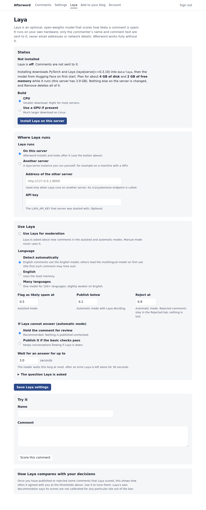

# Laya: optional spam scoring

[Laya](https://pypi.org/project/laya/) is an open-weights "decision model" from
Convai Innovations (Apache 2.0). Instead of generating text, it answers typed
questions about a piece of text with probabilities, in one forward pass.
Afterword asks it one question per comment and gets back a spam score from 0
to 1.

Afterword never needs Laya. Everything works without it, and nothing about
Laya is installed until you press the button.

## What Laya sees

Only the commenter's **name** and **comment text** (the first 2,000
characters). Never email addresses, network information or the page address.
With the default setup, Laya runs on your own server and nothing leaves it
except the one-time downloads during installation.

## What Laya does in each mode

| Mode | Laya's role |
|---|---|
| Manual | None. Never asked. |
| Assisted | Scores each comment. Comments at or above **Flag as likely spam at** get a "likely spam" mark, and you can sort the queue by score. You decide everything. |
| Automatic, "Laya considers it genuine" | Below **Publish below**: published. At or above **Reject at**: moved to the Rejected tab (kept, not deleted). In between: held for you. Basic-check flags (links, blocked terms, repeats) still hold a comment. |
| Automatic, "The basic checks pass" | Scores comments for information if Laya is on, but does not decide. |

Every comment records who decided and why, in words, for example
*"Published by Laya: spam score 0.04 < 0.20"* or
*"Laya unavailable (no answer within 3s); held for review."*

## Installing from the dashboard



1. Open **Laya** in the dashboard.
2. Keep **CPU** selected (right for almost every server) and press **Install Laya on this server**.
3. The page refreshes while it works: it creates a private Python environment in `data/laya`, installs PyTorch (CPU build) and Laya, then starts the service, which downloads the model from Hugging Face the first time.
4. When the status says **Running**, try a comment in **Try it**, then tick **Use Laya for moderation** and save.

Plan for about **4 GB of disk** and **2 GB of free memory** while Laya runs
(the English model has 421 million parameters). The first start takes a few
minutes. Typical CPU answers take a few hundred milliseconds.

The service listens only on `127.0.0.1`, on a free port, with a random API key.
It starts with Afterword when Laya is turned on, is restarted if it crashes,
and is stopped with Afterword. **Remove Laya from this server** deletes
`data/laya` completely and turns Laya off.

The installed version is pinned (`laya[serve]==0.3.10`); change it with
`AFTERWORD_LAYA_PACKAGE`. To forbid installing from the dashboard, set
`AFTERWORD_LAYA_INSTALL=0`.

## Running Laya somewhere else

For a machine with a GPU, or if you prefer to manage it yourself:

```sh
python3 -m venv laya-env
laya-env/bin/pip install "laya[serve]==0.3.10"
LAYA_HOST=127.0.0.1 LAYA_PORT=8000 LAYA_API_KEY=choose-a-long-random-key \
  LAYA_MODELS=english laya-env/bin/laya-serve
```

`laya-serve` binds to all interfaces (`0.0.0.0`) unless you set `LAYA_HOST`.
If it runs on another machine, put it on a private network or VPN and always
set `LAYA_API_KEY`.

Then in the dashboard choose **Another server**, enter its address
(`http://127.0.0.1:8000`) and the key, and save.

## Choosing thresholds

Laya's authors are candid that its scores are **not calibrated for any
particular site out of the box**, and that the general-purpose checkpoints are
a base for specialising rather than a finished judge. So:

1. Start in **Assisted** mode with Laya on. Moderate as usual for a few weeks.
2. Look at **How Laya compares with your decisions** on the Laya page. It shows, for comments you published and rejected, what Laya would have done at the current thresholds. The highlighted cells are the costly mistakes: genuine comments Laya would reject, and rejected ones it would publish.
3. Adjust the thresholds until those cells are acceptable, then consider switching to Automatic with Laya deciding, keeping the fallback on **Hold**.

Rejected comments are kept in the Rejected tab (for 30 days by default), so a
wrong rejection can be undone.

## The question Laya is asked

A two-option `choice` question with the neutral keys `A` (genuine) and `B`
(spam). Laya's documentation notes that yes/no (`noul`) questions can follow
their literal true/false labels on the English checkpoint, and recommends
neutral labels, so Afterword uses them. The wording is editable under **The
question Laya is asked**; test on real comments after changing it.

## Languages

- **Detect automatically** (default): English comments use the English model. Others trigger the multilingual model on first use; that first comment may time out and be held while it loads.
- **English**: least memory.
- **Many languages**: one model for 100+ languages, slightly weaker on English.

## When Laya is unavailable

The comment is saved first, then Laya is asked, so nothing is ever lost. If
Laya does not answer within the timeout (3 s by default), returns an error or
returns something unexpected, the fallback applies: **hold for review**
(default) or **publish if the basic checks pass**. After an error Afterword
leaves Laya alone for 30 seconds so readers are not kept waiting.
**Ask Laya again** in the comment queue re-scores held comments without
changing their status.

## Troubleshooting

| Symptom | Likely cause |
|---|---|
| "Python's venv support is missing" | On Debian/Ubuntu install `python3-venv`. If you followed the README you already have it. |
| Install fails at "Installing PyTorch" | No route to `download.pytorch.org` or PyPI; check the install log and any proxy (`HTTPS_PROXY` is passed through). |
| Stuck on "Starting…", then "Needs attention" | Usually the model download from Hugging Face failed, or the machine ran out of memory. The service log on the Laya page says which. |
| "Laya rejected the API key" | For another server: the key in the dashboard differs from its `LAYA_API_KEY`. |
| Many comments held with "no answer within 3s" | Slow CPU or a language switch loading the second model. Raise the timeout, or choose one language. |
